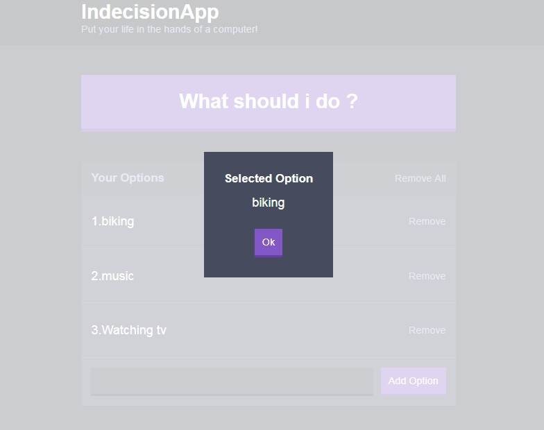

# Indecsion-app-react

> _Ever felt confused about what to do in life, just add all the available options in here and let the app make the decision for you_




## Libraries, languages and buildtools:

- Html
- JSX
- SCSS
- Webpack
- react-modal
- babel

### Installation

##### 1. Download the repository and also install [NodeJs](https://nodejs.org/en/)

Clone the base repository onto your desktop with `git` as follows:

```console
$ git clone https://github.com/supercoder123/indecsion-app-react.git
```

##### 2. Install the dependencies

```
$ npm install
```

##### 3. Start the server

```
$ npm run dev-server
```

##### 4. Navigate to `http://localhost:8080/`
